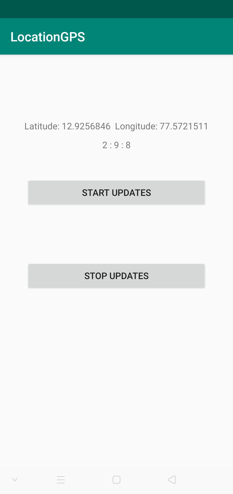

# SmartLocationGPS
library to GPS Location and Network for current location them if needed.
# Demonstration
|Demo Picker Image|
|:---:|
||

[](https://jitpack.io/#kaju02525/SmartLocationGPS)


## Usage
Add this line to build.gradle
```
	 implementation 'com.github.kaju02525:SmartLocationGPS:0.0.1'
   
   maven { url 'https://jitpack.io' }
   
```

```
in Kotlin

class MainActivity : AppCompatActivity(), ActivityCompat.OnRequestPermissionsResultCallback {

     private val TAG = this::class.java.simpleName

    override fun onCreate(savedInstanceState: Bundle?) {
        super.onCreate(savedInstanceState)
        setContentView(R.layout.activity_main)

    }


    private fun onLocationUpdate(location: Location) {
        tv.text="Latitude: ${location.latitude}\tLongitude: ${location.longitude}"
        tvTime.text = getCurrentTimeString()
        Log.d(TAG, "Latitude: ${location.latitude}\tLongitude: ${location.longitude}")
    }

    private fun onError(error: Throwable?) {
        Log.d(TAG, "onError: "+ error?.message)
    }

    fun startUpdates(v: View) {
        Locus.configure {
            shouldResolveRequest = true
        }
        Locus.startLocationUpdates(this) { result ->
            result.location?.let(::onLocationUpdate)
            result.error?.let(::onError)
        }
    }

    fun stopUpdates(v: View) {
        Locus.stopLocationUpdates()
        tv.text=""
    }


    private fun getCurrentTimeString(): String {
        val calendar = Calendar.getInstance()
        return "${calendar.get(Calendar.HOUR_OF_DAY)} : ${calendar.get(Calendar.MINUTE)} : ${calendar.get(
            Calendar.SECOND
        )}"
    }
}


enjoy....
